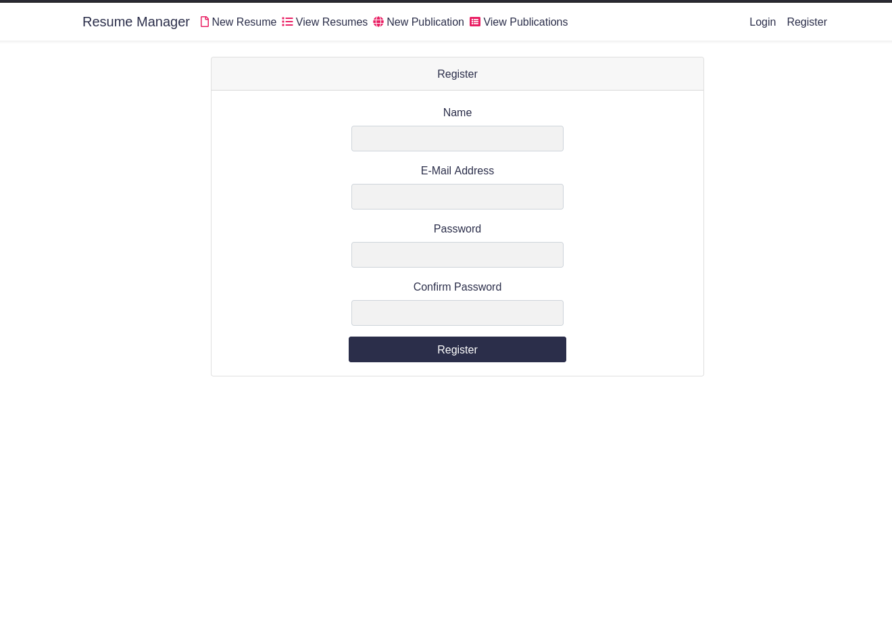
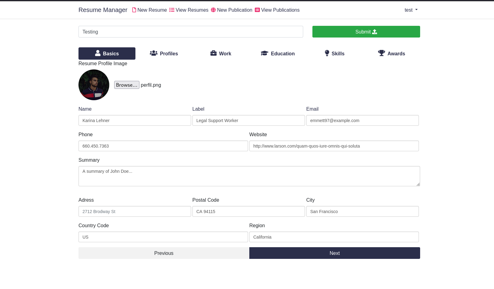
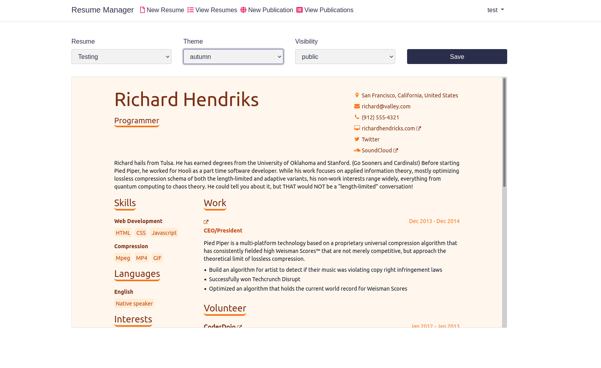

# Readme ResumeManager

Resume manager is a web-app for create and publicate resumes. This application use the `api` of [https://jsonresume.org/](https://jsonresume.org/) for render the themes of each resumes, there are some of them you can choose depending of your necesities.

Here are some screenshots of the application:

